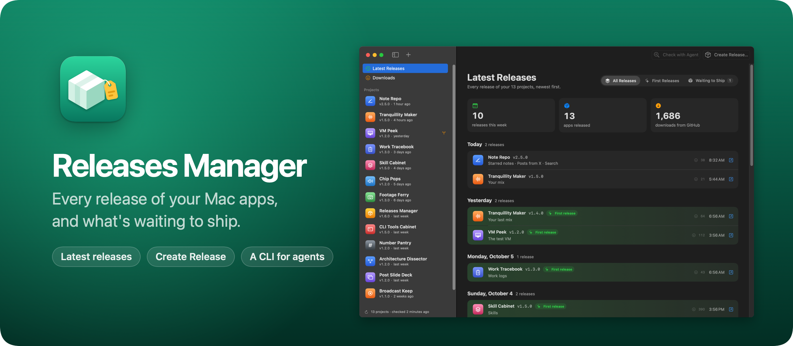
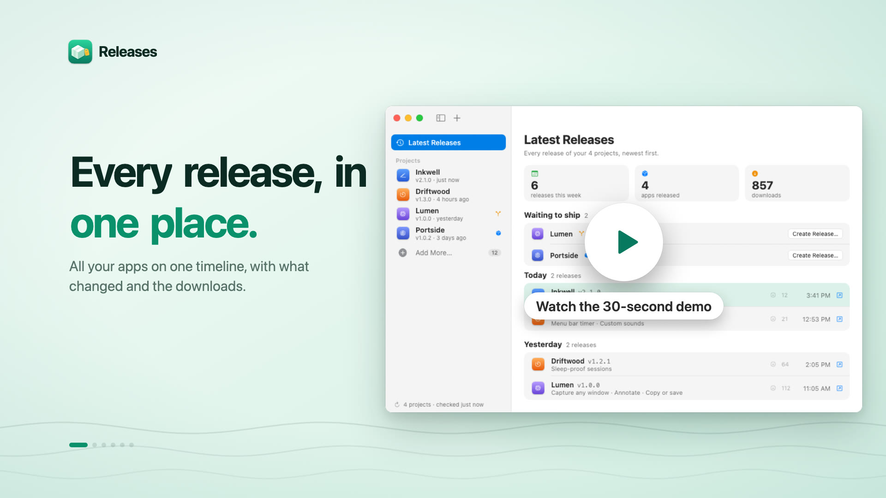
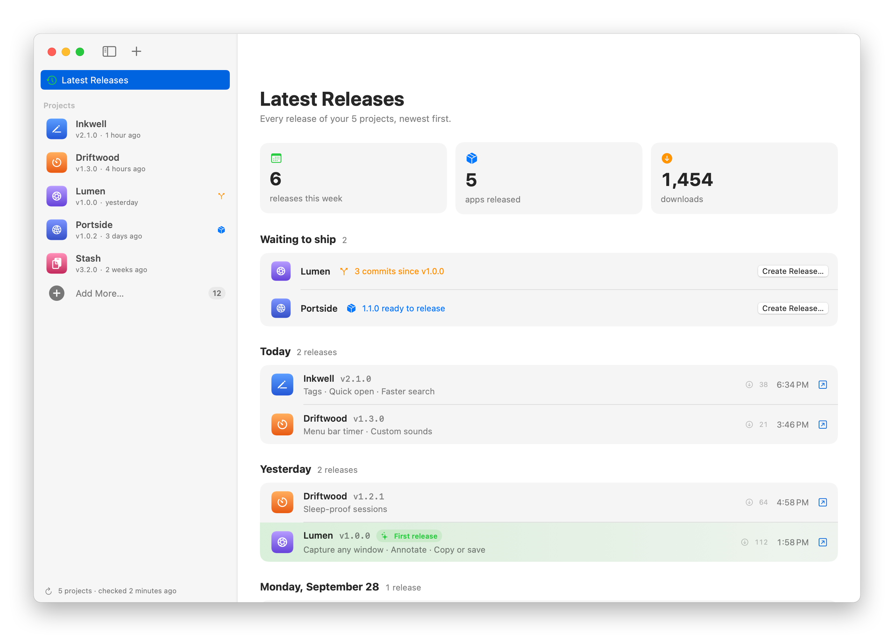
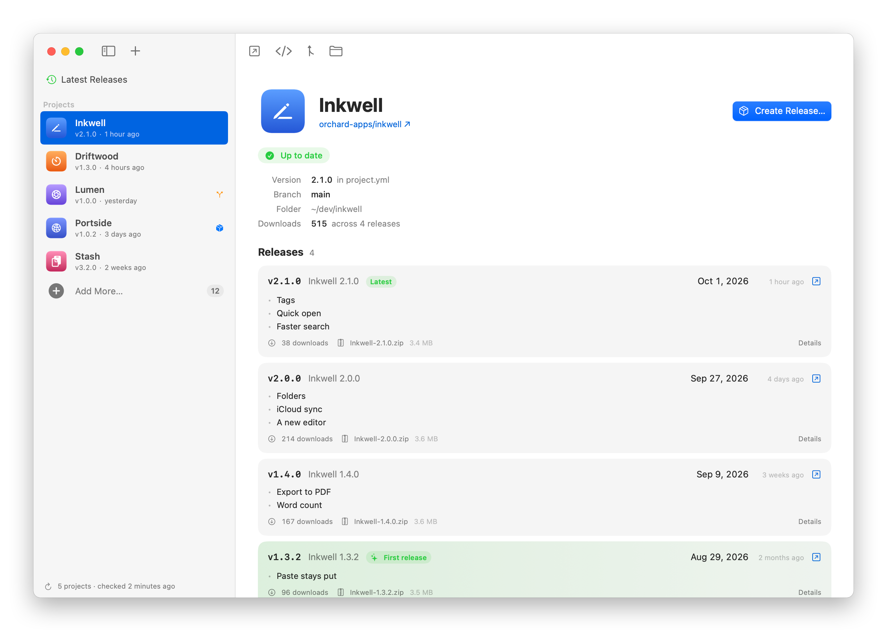

Releases is a Mac app that keeps track of the apps you make: their versions, their GitHub releases, and what's waiting to ship. Open it and you see every release of every project, newest first, with what changed and how many people downloaded it.

GitHub shows one repo at a time. When you build a lot of small apps, it's easy to lose track of which ones have changes waiting for a release. Releases puts all of them in one window, and **Create Release** starts the next one in Cursor.

It comes with a `releases` command that does everything the app does, so a coding agent can do it too.

Read the announcement and watch the 30-second demo on my blog: [I built Releases, a Mac app that tracks every app I release](https://flaviocopes.com/releases/).

[](https://flaviocopes.com/releases/)

## Download

Get `Releases-1.4.0.zip` from the [latest release](https://github.com/flaviocopes/releases/releases/latest), unzip it, and drag Releases to your Applications folder. It runs on macOS 14 Sonoma or later, on Apple silicon and Intel Macs.

### Opening it the first time

Releases is signed with my Apple Developer ID and notarized by Apple. The first time you open it, macOS asks if you're sure you want to open an app downloaded from the internet. Click **Open**.

On a work laptop you might not be able to install apps in `/Applications`. You can keep Releases in the `Applications` folder inside your home folder instead.

### Updates

Once a day, Releases asks GitHub whether there's a newer version. When there is, it shows what's new, and **Install and Relaunch** puts it in place of the old one. **Releases → Check for Updates…** checks right away.

To turn off the daily check, run this in Terminal:

```sh
defaults write com.flaviocopes.releases AppUpdaterAutomaticChecks -bool false
```

## Features

- **Latest Releases** puts every release of every project in one timeline, grouped by day, with its downloads and what changed
- Each app's first release stands out in green. Switch to **First Releases** to see when you launched each app, today, yesterday, in the last 7 days, then month by month
- What changed comes from the project's `CHANGELOG.md`, or from the "What's new" part of the release notes on GitHub
- **Waiting to ship** lists the projects with commits since their last release, or with a version newer than the last release
- Each project shows its version and the file it comes from, its branch, the commits you haven't pushed or released, and every release with its downloads
- **Create Release** suggests the next version, writes the prompt for your coding agent, and opens it in Cursor. Nothing runs until you send it. **Create Releases** does it for every project waiting to ship
- Add a project by dropping its folder on the window, or with `releases add`. **Add More…** lists the apps and command-line tools next to your projects that aren't in the list yet
- The name and the icon come from the app you built, in `dist/` or `build/`. Double-click a project's name to give it another one, in Releases only
- Open a project on GitHub, in Cursor, in GitHub Desktop or in the Finder from its page
- The releases refresh every 10 minutes and when you switch to the app, and `⌘R` refreshes them right away
- A `releases` command for your terminal and your agents, with JSON output
- Updates from inside the app
- Light and dark appearance following the macOS setting

<picture>
  <source media="(prefers-color-scheme: dark)" srcset="docs/screenshot-dark.png" />
  
</picture>

## A project's page

Select a project to see where it stands. The badge says whether it's up to date, how many commits came after the last release, or that the version in the project is ready to release.

<picture>
  <source media="(prefers-color-scheme: dark)" srcset="docs/screenshot-project-dark.png" />
  
</picture>

Releases reads the version from the first of these it finds:

1. `MARKETING_VERSION` in `project.yml`
2. `version` in `package.json`
3. a constant like `static let version = "1.0.0"` in `Sources/`
4. `MARKETING_VERSION` in the Xcode project

## Creating a release

Click **Create Release…** on a project, or next to it in **Waiting to ship**. Pick the version, or bump the latest release with the **Patch**, **Minor** and **Major** buttons, and add anything else the agent should know.

**Continue in Cursor** opens the project in Cursor and puts the prompt in the chat. Cursor never runs it on its own, so you can read it and send it when you're ready. **Copy Prompt** copies it for any other agent.

The prompt has the project, its GitHub repo, the version, and the commits since the last release. It asks the agent to use a skill called `open-source-release` when it has one. That's the skill I use to publish my apps, and you can write your own with that name. Without it, the prompt lists the steps: set the version, tag it, build the app, and publish the GitHub release.

It works for projects that aren't on GitHub yet, too. The prompt then asks the agent to create the repo first.

When more than one project is waiting to ship, click **Create Releases…** in the toolbar of Latest Releases to release them all. Each one gets its next patch version, or the version in the project when it's newer, and you can pick another or uncheck the ones to leave for later. **Continue in Cursor** opens them one after the other, each in its own window with its own prompt.

## Adding projects

Drop a project folder on the window, or click **Add More…** at the end of the sidebar. The + button in the toolbar and `⌘O` do the same. The Add Projects sheet lists the apps and command-line tools next to your projects that aren't in Releases yet. Each one says whether it's on GitHub, whether it has a release, and when you last worked on it. Click **Add**, or **Choose Folder…** for a project somewhere else.

Releases looks right inside the folders that hold your projects. If you track `~/dev/inkwell`, it looks in `~/dev`. With nothing added yet, it looks in `~/dev`, `~/Developer`, `~/Projects` and `~/code`. It never looks in your home folder itself, since reading Desktop or Documents makes macOS ask for permission.

A folder shows up when it has one of these:

- an Xcode project, or a `project.yml` for XcodeGen
- a `Package.swift` with an executable
- a `package.json` with a `bin` command, or an Electron or Tauri dependency
- a built `.app` in `dist/` or `build/`

Clones of other people's repos stay out of the list. Releases knows your GitHub account from the projects you added, so a repo from another account doesn't show up. Neither does a second copy of a project you already track.

Click the eye to hide a project you won't ship, or right-click it to open it in Cursor or the Finder. To bring back a hidden folder, run `releases unhide <folder>`.

## The command line tool

The `releases` command reads the same list as the app, and the app picks up every change right away. Build it from source and link it into `~/.local/bin`:

```sh
./Scripts/install-cli.sh
```

Pass another folder to install it somewhere else, like `./Scripts/install-cli.sh /opt/homebrew/bin`.

| Command | What it does |
| --- | --- |
| `releases add <folder>` | Adds projects to the list |
| `releases list` | Every project with its version, latest release and status |
| `releases recent` | The latest releases across all projects, or only each app's first one with `--first` |
| `releases show <project>` | A project and all its releases |
| `releases discover` | The apps on this Mac that aren't in the list, like Add Projects in the app |
| `releases hide <project>` | Leaves a project out of Add Projects |
| `releases unhide <folder>` | Brings a hidden project back |
| `releases prompt <project>` | Prints the release prompt, or opens it in Cursor with `--cursor`. `--waiting` does it for every project waiting to ship |
| `releases open <project>` | Shows a project in the app, or opens it on GitHub, in Cursor, in GitHub Desktop or in the Finder |
| `releases rename <project> <name>` | Gives a project another name in Releases, or `--reset` to go back |
| `releases refresh` | Fetches every release from GitHub now |
| `releases remove <project>` | Takes projects off the list, and leaves their folders alone |

A project is its folder path, its folder name, its app name, or its GitHub repo. `show` and `prompt` also take a folder that isn't in the list.

```sh
releases show inkwell
releases prompt inkwell --bump minor --cursor
releases discover --offline
```

Run `releases help <command>` for the options of each command.

## For agents

Every command takes `--json`. `releases help --json` lists every command and its options, so an agent can learn the tool in one call. Errors go to stderr with exit code 1.

`releases open` drives the app's window. An agent can show you a project, or open the Create Release sheet with the version and the notes filled in:

```sh
releases open inkwell --release --bump minor --notes "Mention the new Tags feature first"
```

The sheet waits for you. Nothing gets released until you click **Continue in Cursor** and send the prompt.

`releases open` works through the app's `releases://` links, so open the app once first, which tells macOS about them. The links are `releases://home`, `releases://project?path=…`, `releases://release?path=…&version=…&notes=…` and `releases://refresh`.

## GitHub access

Releases asks the GitHub API for the releases of your projects. It signs the requests with the token in `GH_TOKEN` or `GITHUB_TOKEN`, or the one of the [GitHub CLI](https://cli.github.com) when you're logged in with `gh auth login`. With a token, private repos work too.

Without a token it still works, for public repos only. GitHub allows 60 requests an hour that way, which is plenty for a handful of projects.

The token stays in memory. Releases never saves it or prints it.

## Privacy

Releases reads your project folders and their git history on your Mac, and has no accounts or analytics.

It goes online to ask GitHub for the releases of your projects, every 10 minutes while it's open. For **Add Projects**, it also asks about the projects there that are on GitHub, at most once an hour or when you press `⌘R`. Once a day, it asks GitHub whether there's a newer version of Releases, and it downloads one only when you click **Install and Relaunch**.

The list lives in `~/Library/Application Support/Releases/projects.json`, with the folders you added, the releases last fetched from GitHub, and the folders you hid. `releases store-path` prints where it is. Set `RELEASES_STORE` to use another file.

## Build it from source

You need macOS 14 or later, and Xcode 26 or a Swift 6.2 toolchain.

Build the app and open it:

```sh
./Scripts/build-app.sh
open dist/Releases.app
```

The script builds a universal app in `dist/Releases.app` and registers its `releases://` links. It signs with my Developer ID when that certificate is in the keychain, and ad hoc everywhere else, so your copy is signed ad hoc. You can also run the development build with `swift run ReleasesApp`.

A copy you build yourself opens without a warning on your Mac. If you send it to another Mac, macOS says it "could not verify Releases is free of malware". Click **Done**, then go to **System Settings → Privacy & Security** and click **Open Anyway**, or remove the quarantine flag in Terminal:

```sh
xattr -dr com.apple.quarantine /Applications/Releases.app
```

To build the release zip, run:

```sh
./Scripts/build-release.sh
```

It checks that the app has both architectures and that its signature survives the zip, notarizes the zip when the app is Developer ID signed, then writes `dist/Releases-1.4.0.zip`.

## Development

It's a Swift package with three targets and no dependencies. `ReleasesCore` has all the logic, and the app and the command are thin layers on top of it.

```sh
swift test                         # run the tests
swift run releases list            # run the command from source
swift Scripts/render-icon.swift    # draw the app icon into Assets/AppIcon.png
./Scripts/screenshot.sh            # render the screenshots in docs/
swift Scripts/render-banner.swift  # render the banner from the icon and the dark screenshot
```

The screenshots come from the real app views, with made-up projects. The capture app has its own bundle ID and an empty list, so it never touches yours.

To try a change without touching your list, point `RELEASES_STORE` at another file:

```sh
RELEASES_STORE=/tmp/releases-test/projects.json swift run releases list
```

Working with an AI coding agent? Point it at [AGENTS.md](AGENTS.md). It has the commands and the rules to follow.

## How it works

The list only keeps the folders, plus the releases GitHub returned last time. Everything else comes from the folder each time Releases looks: the name and icon of the built app, the version, the GitHub repo from the `origin` remote, the branch, and the commits since the last release's tag. So a version bump or a new commit shows up as soon as you switch to the app.

The app and the command share that file, and the app watches its folder. So a project an agent adds with `releases add` shows up in the window right away, while the `releases://` links go the other way, from the command to the window.

## License

Releases is released under the [MIT license](LICENSE). It's provided as is, without warranty of any kind.
